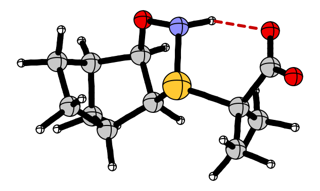

# quickORTEP

A lightweight, fast molecular visualization tool with interactive bond editing, trajectory analysis, and normal mode visualization capabilities designed as a quick visualization tool to be called from a command line, typically through remote SSH connections to HPC systems. 


**Figure 1:** quickORTEP molecular visualization interface showing interactive X11 views with sci-fi theme (top row) alongside their corresponding publication-ready SVG exports (bottom row). The left panels demonstrate atom selection and energy plotting while the right panels show bond selection with length measurement, illustrating the viewer's dual capability for interactive analysis and high-quality graphic generation for scientific publications.

===




## Overview

quickORTEP is a Python-based molecular visualization tool inspired by the classic ORTEP (Oak Ridge Thermal Ellipsoid Plot) program. It provides an interactive, keyboard-driven interface for viewing molecular structures and trajectories, with special attention to bond visualization, energy analysis, and vibrational modes.

## Features

- **Fast X11-based rendering** with optional anti-aliasing (supersampling)
- **Trajectory support** for visualizing molecular dynamics or reaction paths
- **Interactive bond editing** that propagates across trajectory frames
- **Multiple bond types** (covalent, non-covalent interactions, transition state, distance bonds)
- **Real-time energy and bond length plots** for trajectory analysis
- **Normal mode visualization** for vibrational analysis
- **SVG export** for high-quality publication graphics
- **Grid and coordinate axes display** for spatial reference
- **3D visual effects** and depth-based fog for enhanced visualization
- **Multiple visual themes** (Light, Dark, Matrix, Sci-Fi, Print)
- **Keyboard-driven interface** for efficient workflow

## Installation

### Dependencies

- Python 3.9+
- numpy (≥1.19.0)
- python-xlib (≥0.31)
- Pillow (≥8.0.0)
- X11 display server (native on Linux, XQuartz on macOS)

### Installation Methods

#### Option 1: Install via Conda (recommended)

```bash
# Create a new environment for quickORTEP
conda create -n quickortep python=3.9
conda activate quickortep

# Install dependencies
conda install numpy
conda install -c conda-forge python-xlib pillow

# Install quickORTEP (from the project directory)
pip install .
```

#### Option 2: Install via pip

```bash
# From the project directory
pip install .

# Or directly from GitHub
pip install git+https://github.com/yourusername/quickORTEP.git
```

#### Option 3: Install using setup.py directly

```bash
# From the project directory
python setup.py install

# For development installation (changes to code reflect immediately)
python setup.py develop
```

#### Option 4: Install from source without installation

```bash
# Clone the repository
git clone https://github.com/yourusername/quickORTEP.git
cd quickORTEP

# Install dependencies
pip install numpy python-xlib pillow

# Run directly
python quickORTEP.py molecule.xyz
```

### After Installation

When installed via pip or setup.py, you can run the application from any directory:

```bash
# Run the application from any location
quickortep molecule.xyz
```

### Platform-Specific Notes

#### Linux
The application should work out of the box on most Linux distributions as they include X11 by default.

#### macOS
You'll need to install XQuartz to provide X11 support:

```bash
# Using Homebrew
brew install --cask xquartz

# Then restart your computer to complete XQuartz installation
```

#### Windows
This application uses X11 which is not natively available on Windows. You have two options:
1. Use WSL (Windows Subsystem for Linux) with an X server like VcXsrv or Xming
2. Use Cygwin with X11 packages installed

### Verifying Installation

After installation, you should be able to run the application using:

```bash
# If installed via pip or setup.py
quickortep molecule.xyz

# Or if running from source
python quickORTEP.py molecule.xyz
```

## Basic Usage

### Starting the Viewer

```bash
# Basic usage (recommended)
quickortep molecule.xyz

# With anti-aliasing (2x supersampling) - experimental, significantly slower
quickortep molecule.xyz 2

# With custom tile size for larger displays
quickortep molecule.xyz 2 256
```

### Command Line Arguments

- **Argument 1**: Path to molecular structure file (required, XYZ or Gaussian output)
- **Argument 2**: Supersampling factor for anti-aliasing (optional, default=1, values > 1 enable experimental anti-aliasing which is much slower)
- **Argument 3**: Tile size for rendering (optional, default=128)

## User Interface

### Mouse Controls

- **Left click**: Select atoms and bonds
- **Shift + Left click**: Add to selection / deselect
- **Shift + Double click**: Reset view
- **Middle button/scroll**: Zoom in/out
- **Right drag**: Pan view
- **Left drag**: Rotate molecule (primary axes)
- **Shift + Left drag**: Rotate molecule around Z-axis

### Keyboard Controls

#### View Navigation

- **h/j/k/l**: Rotate around axes (vim-style)
- **u/o**: Rotate around Z-axis
- **H/J/K/L**: Pan the view
- **n/m**: Zoom in/out
- **f**: Toggle fog effect
- **( / )**: Decrease/increase fog density
- **3**: Toggle 3D effects (highlights and shadows)
- **F**: Fit molecule to window
- **r**: Reset view

#### Atom and Bond Manipulation

- **b**: Cycle through bond types for selected bond
- **B**: Toggle bond (add/remove) between selected atoms
- **c**: Clear all bond edits
- **d**: Toggle hydrogen display
- **g**: Toggle grid display
- **a**: Toggle coordinate axes

#### Trajectory Navigation

- **[/]**: Previous/next frame
- **{/}**: First/last frame
- **-/=**: Jump to lowest/highest energy frame
- **t**: Convert current frame to standard orientation
- **T**: Convert all frames to standard orientation
- **R**: Reload current file from disk

#### Normal Mode Visualization

- **v**: Toggle normal mode vectors
- **,/.**: Previous/next normal mode
- **</>**: Decrease/increase normal mode scale

#### Other Controls

- **p**: Toggle between energy and bond length plots
- **P**: Toggle bond propagation across frames
- **s**: Export current view as SVG
- **x**: Export current frame as XYZ
- **w**: Export current graph data
- **?**: Show help overlay
- **q or Escape**: Quit

## Features in Detail

### Bond Types

quickORTEP supports multiple bond types that can be cycled through with the 'b' key:

1. **Distance Bond**: Thin line for tracking distances
2. **Covalent Bond**: Standard bond representation
3. **NCI Bond**: Non-covalent interaction (dashed)
4. **TS Bond**: Transition state bond (special color)

### Trajectory Visualization

When viewing trajectory files (multi-frame XYZ or Gaussian output):

- A small energy plot is shown in the bottom-right corner
- When a bond is selected, press 'p' to toggle between energy and bond length plots
- Use bracket keys ([, ]) to navigate through frames
- Use {, } to jump to first or last frames
- Use -, = to jump to lowest or highest energy frames

### Bond Editing and Propagation

Bond edits can be propagated across trajectory frames:

1. Select two atoms (click on first, then Shift+click on second)
2. Press 'B' to create a bond
3. With a bond selected, press 'b' to cycle through bond types
4. Enable bond propagation with Shift+p to apply these changes to all frames

### Normal Mode Visualization

For Gaussian frequency calculation results:

1. Navigate to the appropriate frame 
2. Press 'v' to visualize normal modes
3. Use , and . to cycle through available modes
4. Use < and > to adjust the visualization scale
5. Imaginary frequencies are displayed in red

### Visual Effects

Enhance your visualization with depth effects:

1. Press 'f' to toggle the fog effect (adds depth perception)
2. Use ( and ) to adjust fog density
3. Press '3' to toggle 3D effects (highlights and shadows on atoms)
4. Use different themes for different visualization purposes

### Standard Orientation

Convert molecule coordinates to a standardized orientation:

1. Press 't' to convert the current frame to standard orientation
2. Press 'T' to convert all frames in a trajectory to standard orientation

### SVG Export

Press 's' to export the current view as an SVG file, which is useful for creating publication-quality figures.

## File Formats

### Supported Input Formats

- **XYZ files**: Standard XYZ format for single molecules or trajectories
- **Gaussian output files**: Log files from Gaussian calculations with energy and/or frequency information

## Advanced Usage

### Anti-aliasing

For better visual quality, you can use supersampling, though be aware that this feature is experimental and can be significantly slower than the standard rendering mode:

```bash
quickortep molecule.xyz 2  # 2x supersampling
quickortep molecule.xyz 4  # 4x supersampling (much slower but higher quality)
```

Note: The supersampled mode is not generally recommended for regular use due to performance considerations, especially on older hardware or for complex molecules.

### Customizing Appearance

Edit `config.py` to customize:
- Atom rendering style
- Bond colors and thicknesses
- Interaction settings
- Graph themes
- Color schemes (light, dark, sci-fi, matrix, and print themes available)

#### Changing Themes

To change themes, modify the `CURRENT_THEME` variable in `config.py`:

```python
# Open config.py in a text editor
# Find this section near the bottom of the file:

# Options: LIGHT_THEME, DARK_THEME, SCIFI_THEME, MATRIX_THEME, PRINT_THEME
CURRENT_THEME = SCIFI_THEME  # Change to your preferred theme
```

Available themes include:
- `LIGHT_THEME`: White background with black text and bonds (default)
- `DARK_THEME`: Black background with light gray text and bonds
- `SCIFI_THEME`: Dark blue-black background with cyan/teal elements
- `MATRIX_THEME`: Black background with green elements (cyberpunk style)
- `PRINT_THEME`: Optimized for publication/printing with white background and high contrast

After changing the theme, restart quickORTEP for the changes to take effect.

## Exporting Data

### SVG Export (Key: s)
Exports the current visualization as an SVG file with publication-quality graphics.

### XYZ Export (Key: x)
Exports the current frame as an XYZ file.

### Graph Data Export (Key: w)
Exports the data from the current graph (energy or bond length) as a text file.

## Troubleshooting

### X11 Connection Issues

If you encounter X11 connection issues:

```bash
# Check X11 forwarding settings if using SSH
ssh -X user@host

# Set display variable if needed
export DISPLAY=:0
```

## Project Structure

The project is organized into several modules:

- **quickORTEP.py**: Main entry point
- **ortep_viewer.py**: Core visualization logic
- **molecule.py/molecule_nci.py**: Molecule representation and non-covalent interaction detection
- **trajectory.py**: Trajectory handling for multi-frame visualizations
- **normal_modes.py**: Vibrational mode analysis
- **x11view/**: X11 rendering backends (basic and supersampled)
- **config.py**: Customization options and themes

## Acknowledgments

Coded using the following LLMs: ChatGPT (o1 Pro and o3-mini-high), Claude (3.7 Sonnet Extended), and Gemini (2.5 Pro). 
